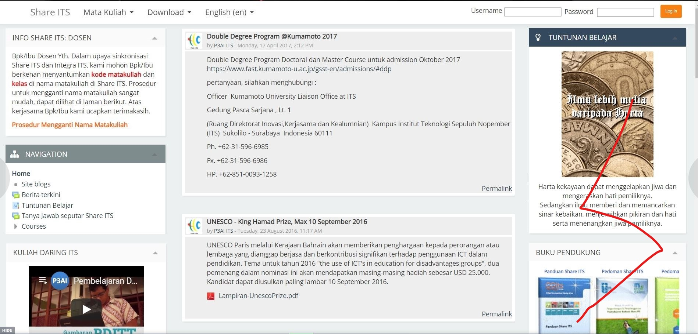
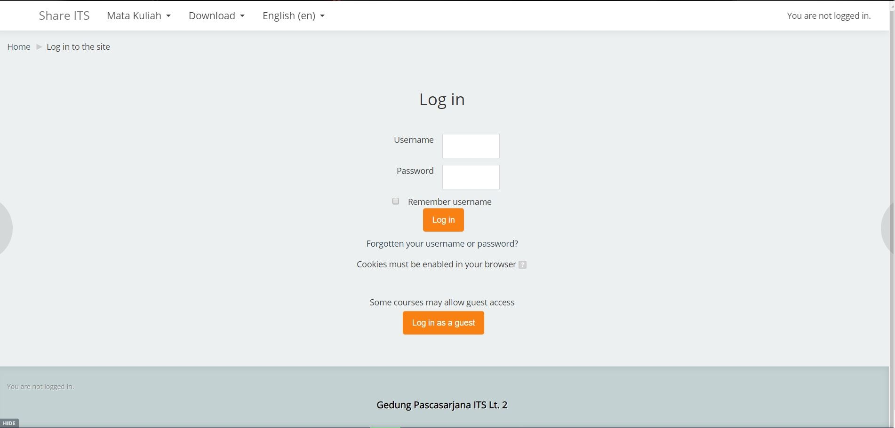
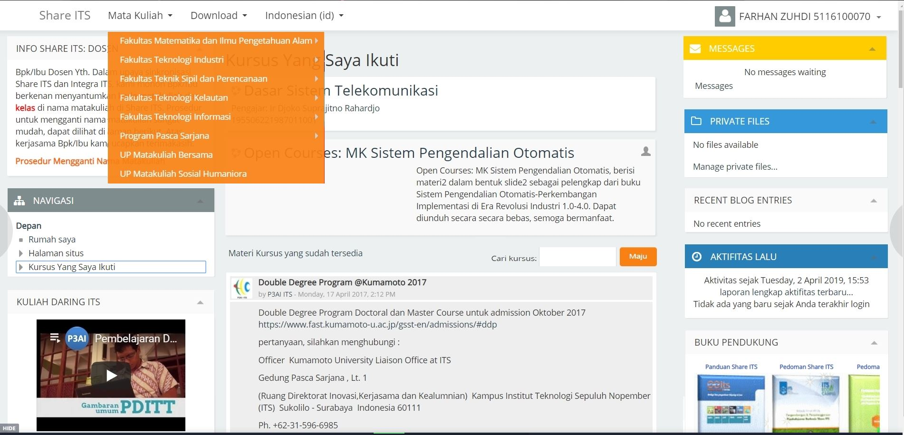
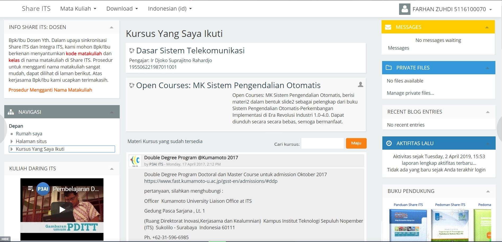
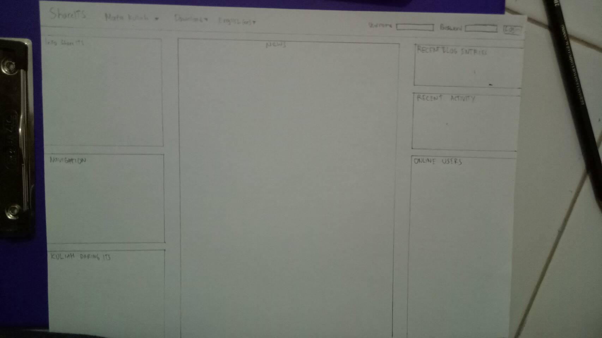

# Usability Evaluation and Prototyping (again)
## Operating the Prototype
Here's the video of ShareITS website prototype. 

---

## Part A: Usability Evaluation
### 1. Brief Description of Participants
#### a. Description of Participant 1
- The user is male 21 years old
- He is a student of Civil Engineering ITS
- It is his second time using ShareITS, including when he was the participant for contextual iquiry and analysis.

#### b. Description of Participant 2
- The user is male 21 years old
- He is a student of Naval Architecture ITS
- He has used ShareITS before.

### 2. Evaluation Script 
1.Login into the website
2.Finding the user's department
3.Finding the list of courses in the user's account

### 3. Transcript

#### a. Transcript with Participant 1
1.	**Me**	: Hai, sibuk ga?
2.	**Participant**	: Hai, ada apa?
3.	**Me** : Kamu inget kan website ShareITS yang waktu itu aku suruh kamu coba? kali ini aku udah buat prototype web itu, bisa tolong coba lagi ga? 
4.	**Participant** :Ohh bisa kok.
5.	**Me**	:Sebelumnya, udah pernah buka ShareITS?
6.	**Participant** :Baru waktu kamu suruh aja sih.
7.	**Me**	:Ohh yasudah, kalau begitu langsung liat aja protoypenya ya.
8.	**Participant**	:Ok.
9.	**Me**	: Nih, gimana Menurut kamu?
10.	**Participant**	: Nah, ini lebih keliatan Menu"nya, jadi lebih enak diliat juga tampilannya.
11.	**Participant** : Tapi menurutku mending yang tuntunan belajar sama buku panduannya ilangin aja deh ga terlalu berguna keliatannya, sama biar recent activity sama online usernya langsung keliatan diatas. Terus buku panduannya taruh di download aja tuh.
12.	**Me**  : Bener juga kamu ya, makasih masukannya. 
13.	**Participant**: Iya samasama, terus aku ngapain lagi nih?
14.	**Me**	:Coba kamu login dulu.
15.	**Participant**	:Loginnya gimana ini gabisa ngetik usernamenya?
16.	**Me**	:Ohiya, untuk sementara langsung klik aja tombol" loginnya soalnya ini cuma prototype.
17.	**Participant**	:Ohh gitu, trus apalagi yang harus dicoba?
18.	**Me**: Coba cari fakultas kamu.
19.	**Participant**: Gampang itu mah ada di menu atas
20.	**Me**	: Oke, coba sekarang buka matakuliah yang sedang diikuti
21.	**Participant**	: Udah nih, lebih mudah ketemunya soalnya gaperlu scroll lagi haha.
22.	**Me**	:Haha iya kemaren kan kamu bingung tuh nyari"nya.
23.	**Participant**: Tapi kalau gasalah ada menu" yang bentuknya icon gitu deh halaman utamanya, itu kamu hapus?
24.	**Me**	:Iya, soalnya kamu bilang kemaren garapih tampilannya.
25.	**Me**  :Tampilannya jadi lebih bagus gaada menu itu apa gimana?
26.	**Participant**	:Menurutku udah bagus sih diapus, lagian menu departmentnya ada diatas tuh.
27.	**Me**	:Nah itu makanya haha.
28.	**Participant**	: Ada yang perlu dicoba lagi ga?
29.	**Me**  :Udah selesai kok. Makasih ya udah mau bantu.
30.	**Participant**	:Oke, sama-sama

#### b. Transcript with Participant 2
1.	**Me**	:Siang bro, lagi sibuk ga?
2.	**Participant**	:Ngga, lagi gabut malah ini, ada apa?
3.	**Me**	:Kamu pernah pake ShareITS ga?
4.	**Participant**	:Oh pernah sekali waktu kuis matkul pengayaan.
5.	**Me**	:Ohh bagus deh kalo udah pernah, jadi aku buat prototype web ShareITS nih, bisa minta waktumu buat nyoba ga?
6.	**Participant**	: Bisa kok, mana coba liat.
7.	**Me**	:Nih, gimana menurutmu tampilannya?
8.	**Participant**	:Aku agak lupa tampilan ShareITS, tapi kok mirip ya?
9.	**Me**	:Ohh emg mirip ini, aku ubahnya cuma beberapa tampilan dan menu yang gaperlu.
10.	**Participant**	:Oh gituu, trus aku harus ngapain nih?
11.	**Me**	:Coba sekarang login dulu.
12.	**Participant**	:Ini prototype kan? berarti gaperlu akun ya?
13.	**Me**: Iya betul.
14.	**Participant**: Udah nih, abis itu ngapain lagi?
15.	**Me**: Coba cari fakultas kamu.
16.	**Participant**: udah, tapi kok gabisa di klik ya?
17.	**Me**: Iya, untuk sekarang blom bisa di klik, masih prototype ini soalnya.
18.	**Me**: Sekarang coba cari mata kuliah yang lagi kamu ikuti.
19.	**Participant**: Itu di tengah udah ada.
20.	**Participant**: Eh, seingetku bukannya ada dibawah ya matakuliahnya?
21.	**Me**: Iya aku ubah biar langsung keliatan gitu, gaperlu nge scroll ke bawah lagi. Gimana menurutmu?
22.	**Participant**: Bagus kok, jadi lebih gampang nyari nya. Soalnya waktu kuis pake ShareITS kan ga sengaja ke close tuh tabnya, terus aku bingung nyari matakuliahnya dimana, jadinya ngetik linknya deh.
23.	**Me**: hahaha kasian amat harus ngetik, linknya kan lumayan panjang tuh.
24.	**Participant**: haha, ada lagi ga nih?
25.	**Me**: Udah segitu dulu, makasih ya bantuannya.
26.	**Participant**: ya, sama-sama

### 4. Feedback and Incidence Analysis

#### OBSERVATION 1 Main Page

 - **Reference**: 
   - Participant 1, line 10-12)
   - Participant 2, line 8-9)
 - **Feedback**: Mostly positive. But, participant 1 said that its better to remove the quote box and the guide book box, because it doesnt seem usefull. And he said that its better to make the recent activity and online user replace it.(Participant 1, line 11).
 - **Incidence**: -
 - **Reason**: -
 - **Resolution**: I will do as the participant 1 said, because his suggestion is good.
 
#### OBSERVATION 2 Login Page

 - **Reference**: 
   - Participant 1, 14-16
   - Participant 2, 11-13
 - **Feedback**: Positive
 - **Incidence**: Participant 1 was not able to input his username on the text field.(Participant 1, line 15)
 - **Reason**: Because it is still a prototype, the interactions are limited.
 - **Resolution**: -
 
#### OBSERVATION 3 Faculty Menu

 - **Reference**:  
   - Participant 1, 18-19
   - Participant 2, 15-17
 - **Feedback**: -
 - **Incidence**: Participant 2 was not able to click faculty. (Participant 2, line 16.
 - **Reason**: Because i limit most of the feature to keep it simple and still able to cover and fix most of the problems.
 - **Resolution**: -
 
 #### OBSERVATION 4 My Course

 - **Reference**:  
   - Participant 1, 20-30
   - Participant 2, 18-26
 - **Feedback**: Positive, because the menus can be seen easily.
 - **Incidence**: -
 - **Reason**: -
 - **Resolution**: -
 
 ---

## Part B: Prototyping (again)
> Next, you will need to modify your prototype 
> based on the resolutions you have suggested in `Feedback and Incidence Analysis`'s observations.

### Sketch

### Design Rationale
> Please write a paragraph expressing what you have learned from the usability evaluation, 
> and how it is reflected in your design.
Usability evaluation helps the designer to gather the flaws of the design that can only be found from whole different prespective. Having an IT background make the designer halt the designer to make an improvement. By asking novice users to try the design, the designer may found the flaws that seemed okay for advanced users but is a no-go for novice users. And so, the design can be improved after that.

### High-Fidelity Interactive-Prototype
[Link of modified prototype](https://invis.io/RXRTJWB64PB)

